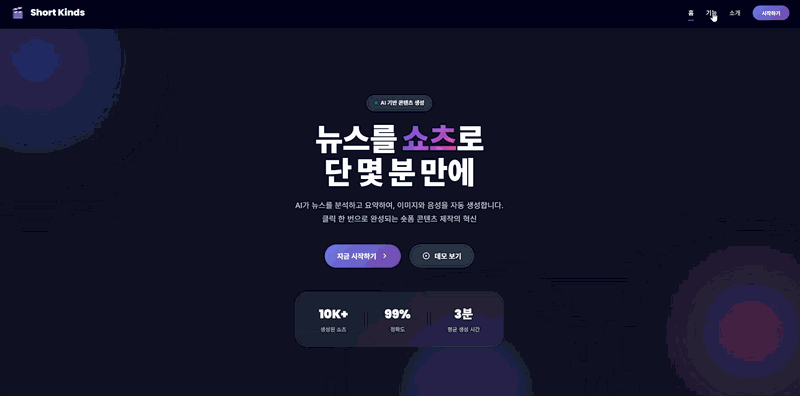
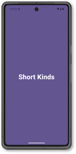

<div align="center">

# 📰 Short Kinds

### AI가 만드는 1분 뉴스 쇼츠

*긴 기사는 그만, 핵심만 쏙쏙 담은 숏폼으로 세상을 만나보세요*

<br>

[](https://www.python.org/)
[](https://fastapi.tiangolo.com/)
[](https://openai.com/)
[](LICENSE)

<br>



*AI가 뉴스를 쇼츠로 만드는 실제 생성 과정*

</div>

---

## 🎯 왜 만들었나요?

> "뉴스는 중요한데... 읽기는 귀찮아요"

현대인들은 뉴스의 중요성은 알지만, 긴 기사를 읽을 시간이 없습니다. **Short Kinds**는 AI가 뉴스를 1분 안에 이해할 수 있는 숏폼 콘텐츠로 자동 변환해줍니다.

## ✨ 무엇을 할 수 있나요?

```
� 뉴스 선택 → 🤖 AI 요약 → 🎨 이미지 생성 → 🎙️ 음성 변환 → 🎬 쇼츠 완성!
```

- **🤖 자동 요약** - BIG KINDS API로 최신 뉴스를 수집하고 핵심만 추출
- **🎨 AI 이미지** - OpenAI DALL-E가 뉴스 내용에 맞는 이미지 생성
- **🎙️ TTS 음성** - 자연스러운 음성으로 뉴스를 들려줌
- **🎬 원클릭 제작** - 모든 과정이 자동으로, 클릭 한 번이면 끝

## 🚀 5분 안에 시작하기

```bash
# 1. 클론
git clone https://github.com/yourusername/ShortKinds.git
cd ShortKinds

# 2. 설치
pip install -r requirements.txt

# 3. API 키 설정
cp .env.example .env
# .env 파일에 KINDS_ACCESS_KEY 입력

# 4. 실행
python -m uvicorn backend.main:app --reload --port 8000
```

🌐 브라우저에서 **http://localhost:8000** 접속!

> 💡 자세한 설정은 [QUICKSTART.md](QUICKSTART.md) 참조

## 📱 어떻게 생겼나요?

### 앱에서 보기
<div align="center">



</div>

### 완성된 쇼츠 예시
<div align="center">


*현대자동차 관련 뉴스로 생성된 쇼츠*

</div>

**웹 인터페이스 특징:**
- 🎨 모던한 글래스모피즘 디자인
- ⚡ 실시간 진행 상황 확인
- � 모바일부터 데스크톱까지 완벽 대응
- 🎬 데모 비디오로 미리보기

## 🛠️ 기술 스택

<div align="center">

| Category | Technologies |
|----------|-------------|
| **Backend** | FastAPI, Python 3.8+ |
| **Frontend** | HTML5, CSS3, Vanilla JS |
| **AI/ML** | OpenAI API, Transformers |
| **APIs** | BIG KINDS, Google Cloud TTS |

</div>

## 🎬 작동 원리


1. **뉴스 수집** - BIG KINDS API에서 최신 뉴스 가져오기
2. **AI 요약** - 핵심 내용만 추출
3. **이미지 생성** - DALL-E로 관련 이미지 자동 생성
4. **음성 변환** - TTS로 자연스러운 음성 생성
5. **쇼츠 제작** - 모든 요소를 결합하여 완성

## 🤝 기여하기

이슈와 PR은 언제나 환영합니다! 🎉

## 📄 라이선스

MIT License - 자유롭게 사용하세요!

---

<div align="center">

**Made with ❤️ by Short Kinds Team**

⭐ 이 프로젝트가 마음에 드셨다면 Star를 눌러주세요!

</div>
